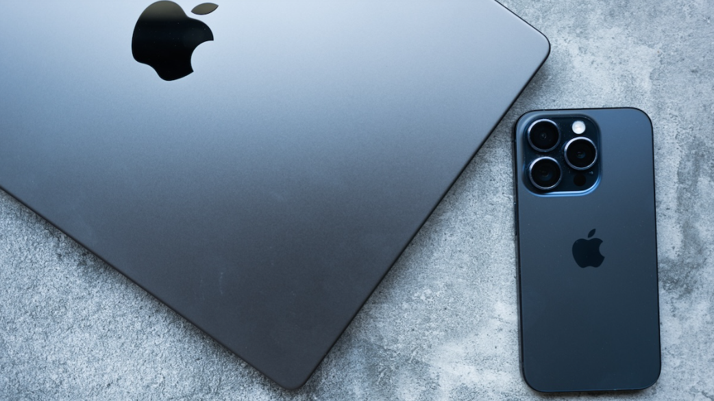
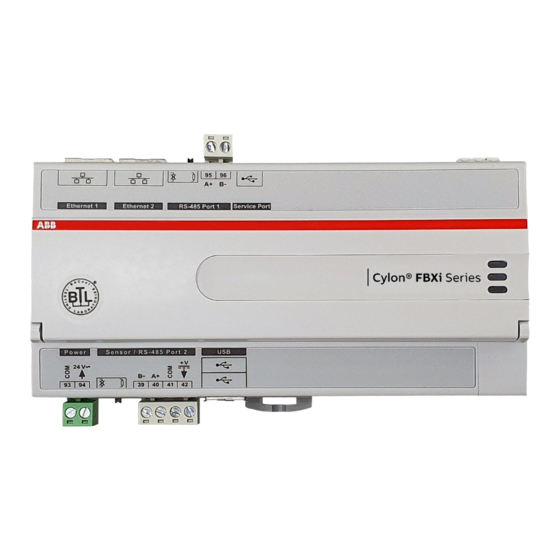

---
hide:
  - navigation
  - toc
---

# Today's Security Incidents

-   
    :material-apple:{ .lg .middle } __Multiple Vulnerabilities in Apple Products__

    **Multiple Vulnerabilities**{.cve-chip}
    **Critical Severity**{.cve-chip}
    ---
    Multiple critical vulnerabilities disclosed and patched in iOS, iPadOS, macOS, watchOS, tvOS, visionOS, and Safari. Exploitation can lead to device compromise, privacy violations, information leakage, and remote code execution. Update to latest versions immediately.
    [:octicons-arrow-right-24: View Full Details](Week46/apple.md)

-   
    :material-factory:{ .lg .middle } __ABB FLXeon Controllers Vulnerabilities__

    **Multiple Vulnerabilities**{.cve-chip}
    **Critical Severity**{.cve-chip}
    **Remote Code Execution**{.cve-chip}
    ---
    Multiple high-severity vulnerabilities—including hard-coded credentials, improper input validation, weak password hashing, and file path manipulation—impact ABB FLXeon series controllers (FBXi, FBVi, FBTi, CBXi) running firmware version 9.3.5 and earlier. Attackers may achieve full system compromise, code execution, or disrupt industrial operations. Firmware update and strict access controls are urgently advised.
    [:octicons-arrow-right-24: View Full Details](Week46/abb-fbxi.md)

