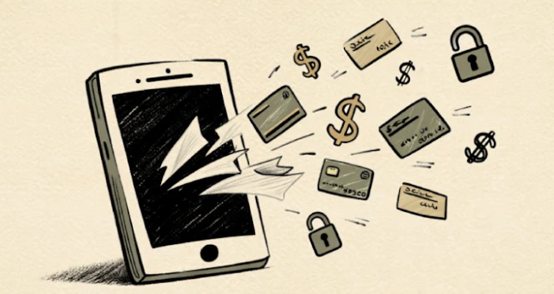

---
hide:
  - navigation
  - toc
---

# Today's Security Incidents

-   
    :material-bank-transfer:{ .lg .middle } **GoldFactory Hits Southeast Asia with Modified Banking Apps Driving 11,000+ Infections**

    **Modified Banking Apps**{.cve-chip}  
    **Hooking Malware**{.cve-chip}  
    ---------------------------------

    GoldFactory distributed modified versions of legitimate banking apps in Indonesia, Vietnam, and Thailand. Over **27 banking apps** were injected with malicious hooking code (FriHook, SkyHook, PineHook) that enables remote access, intercepts app logic, steals credentials, and views balances. Social engineering (vishing) tricks victims into side-loading fake apps. Two-stage infection uses dropper trojans (Gigabud, Remo, MMRat) followed by modified banking apps. **11,000+ documented infections** with ~63% targeting Indonesian users.

    [:octicons-arrow-right-24: View Full Details](Week50/goldfactory.md)

-   
    :material-whatsapp:{ .lg .middle } **WhatsApp-Based Malware Campaign by Water Saci**

    **Banking Trojan**{.cve-chip}  
    **WhatsApp Worm**{.cve-chip}  
    ---------------------------------

    Sophisticated multi-stage campaign targeting Brazilian WhatsApp users. Attackers send malicious PDF or HTA attachments via WhatsApp from compromised contacts. If opened, triggers download of MSI installer + Python script that installs a banking trojan and auto-propagates to all contacts via WhatsApp Web (Selenium automation). Trojan monitors for Brazilian banking/crypto sites, creates fake overlays, performs keylogging, and screen capture. **Worm-like spread** through contact lists enables rapid, large-scale compromise.

    [:octicons-arrow-right-24: View Full Details](Week50/watersaci.md)

