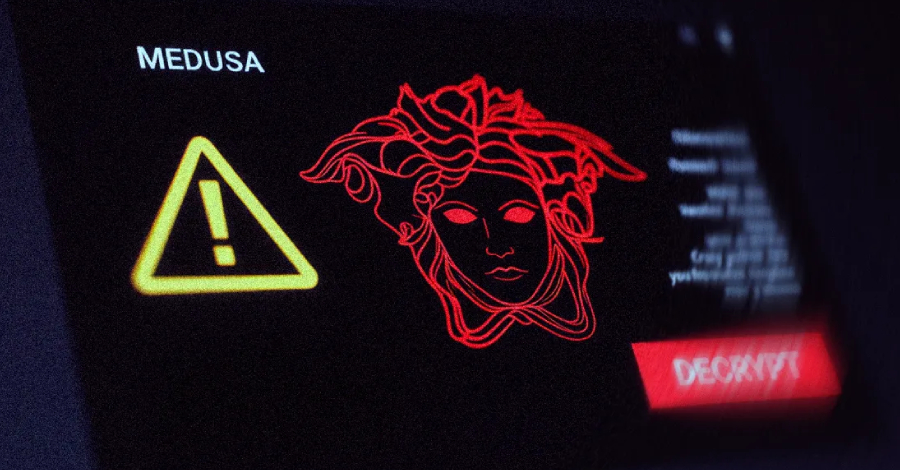

---
hide:
  - navigation
  - toc
---

# Today's Security Incidents

-   

    **GPUBreach / GPU Rowhammer Attack**

    **GPU Vulnerability**{.cve-chip} **Memory Attack**{.cve-chip} **Privilege Escalation**{.cve-chip}
    
    A newly disclosed Rowhammer-style attack technique against GPU memory (VRAM). Attackers can manipulate memory integrity, bypass isolation mechanisms, and escalate privileges to gain full system control.
    
    [Read more](2026/Week14/GPUBreach.md)

-   

    **China-Linked Storm-1175 Zero-Day Exploitation Campaign**

    **China-Linked APT**{.cve-chip} **Zero-Day Exploitation**{.cve-chip} **Medusa Ransomware**{.cve-chip}
    
    A sophisticated China-linked threat actor rapidly exploiting zero-day and recently disclosed vulnerabilities in enterprise software. The group completes full system compromise within hours, exfiltrating data and deploying Medusa ransomware through double extortion tactics.
    
    [Read more](2026/Week14/Storm-1175.md)

