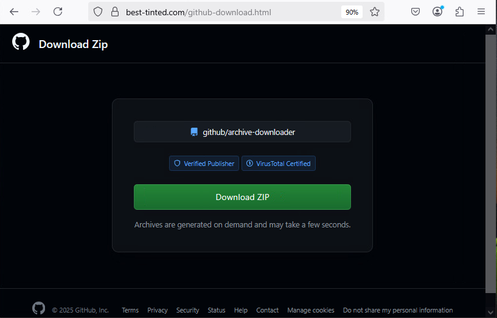
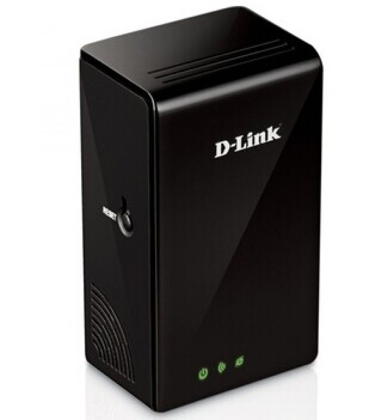
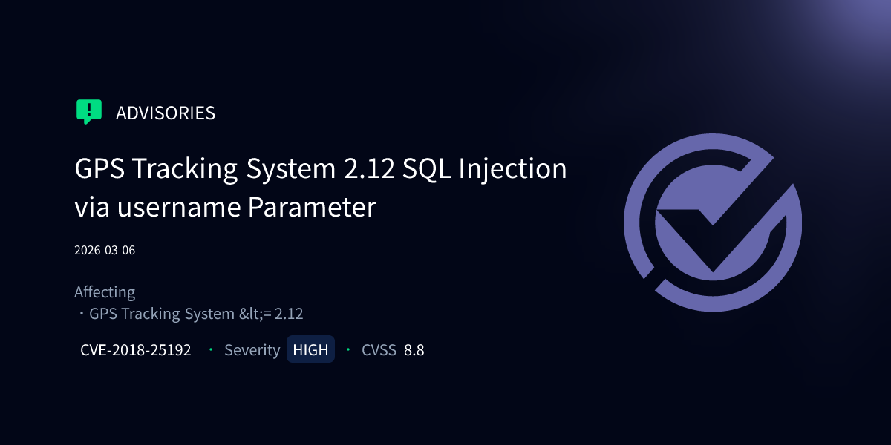

---
hide:
  - navigation
  - toc
---

# Today's Security Incidents

-   

    **BoryptGrab Infostealer GitHub Distribution Campaign**

    **BoryptGrab**{.cve-chip} **Malicious GitHub Repos**{.cve-chip} **Windows Infostealer**{.cve-chip} **TunnesshClient**{.cve-chip}

    Researchers identified a large-scale malware operation abusing more than 100 fake GitHub repositories disguised as cheats, cracked tools, and utilities to deliver the BoryptGrab infostealer to Windows users. Victims are lured through SEO manipulation and social-engineering download pages.

    The malware steals browser credentials, wallet data, and messaging tokens, and in some cases installs TunnesshClient to establish reverse SSH tunnels and persistent remote access, increasing risk for both individual users and enterprise endpoints.

    [:octicons-arrow-right-24: Read more](2026/Week10/github.md)

-   

    **CVE-2025-70231 – Path Traversal Vulnerability in D-Link DIR-513 Router**

    **CVE-2025-70231**{.cve-chip} **Path Traversal**{.cve-chip} **CWE-22**{.cve-chip} **Unauthenticated Access**{.cve-chip}

    A critical path traversal flaw in D-Link DIR-513 firmware 1.10 allows unauthenticated attackers to abuse unsanitized `FILECODE` handling in `/goform/` endpoints and read sensitive files from the router filesystem.

    Successful exploitation can expose administrator credentials, Wi-Fi and network configuration data, and enable follow-on compromise such as traffic redirection, persistent device takeover, or botnet abuse.

    [:octicons-arrow-right-24: Read more](2026/Week10/dlink.md)

-   

    **SQL Injection Vulnerability in GPS Tracking System Login – CVE-2018-25192**

    **CVE-2018-25192**{.cve-chip} **SQL Injection**{.cve-chip} **CWE-89**{.cve-chip} **Authentication Bypass**{.cve-chip}

    A high-severity SQL injection vulnerability in GPS Tracking System 2.12 allows unauthenticated attackers to manipulate login queries by injecting payloads into the username parameter, bypassing authentication checks.

    Successful exploitation can expose location and fleet management data, enable unauthorized dashboard access, and provide a foothold for further compromise through record tampering, credential theft, or lateral activity.

    [:octicons-arrow-right-24: Read more](2026/Week10/gps.md)

-   

    **CVE-2026-3804 – Tenda i3 Router Stack-Based Buffer Overflow**

    **CVE-2026-3804**{.cve-chip} **Stack Overflow**{.cve-chip} **CWE-121**{.cve-chip} **Router RCE Risk**{.cve-chip}

    A vulnerability in Tenda i3 firmware 1.0.0.6(2204) affects `/goform/WifiMacFilterSet`, where improper validation of the `index` parameter can trigger a stack-based buffer overflow and destabilize or compromise device operation.

    Attackers with network reachability may exploit the flaw to gain unauthorized control, alter router configuration, redirect traffic, or crash services, creating both security and availability risks at the network edge.

    [:octicons-arrow-right-24: Read more](2026/Week10/tenda.md)

