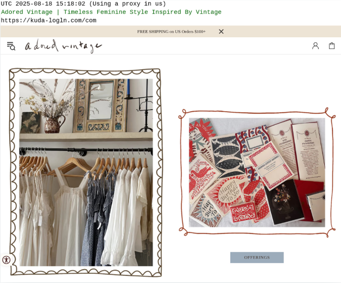

---
hide:
  - navigation
  - toc
---

# Today's Security Incidents

- 
  :material-security-network:{ .lg .middle } **Lighthouse Phishing-as-a-Service (PhaaS) Operation**

  **Phishing-as-a-Service (PhaaS)**{.cve-chip}
  **Critical Global Smishing Campaign**{.cve-chip}
  ------------------------------------------------

  Google filed suit in Nov 2025 to dismantle *Lighthouse* — a China-linked PhaaS that powered mass SMS (“smishing”) campaigns, spun up ~200k phishing sites in weeks, and impersonated 400+ brands to steal millions of payment/credential records worldwide. Legal injunctions, domain takedowns, and cross-provider coordination were pursued to disrupt the service.
  [:octicons-arrow-right-24: View Full Details](Week46/Lighthouse.md)

