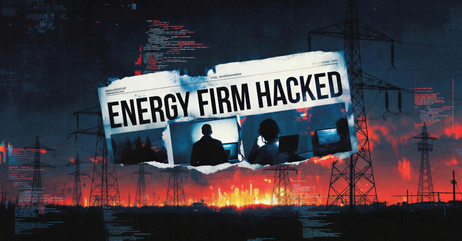

---
hide:
  - navigation
  - toc
---

# Today's Security Incidents

-   

    **Iranian Hackers Targeted Major South Korean Electronics Maker**

    **Seedworm / MuddyWater**{.cve-chip} **Iran-Linked APT**{.cve-chip} **DLL Sideloading**{.cve-chip}

    Iran-linked Seedworm / MuddyWater breached a major South Korean electronics manufacturer and eight other organizations across nine countries using DLL sideloading with signed Fortemedia and SentinelOne binaries, Node.js implants, and PowerShell credential theft. Exfiltration was routed through the public file-transfer service sendit.sh to blend with normal SaaS traffic.

    [Read more](2026/Week19/Iranian.md)

-   

    **Azerbaijani Energy Firm Hit by Repeated Cyber Attacks**

    **Noname057(16)**{.cve-chip} **Hacktivist**{.cve-chip} **Energy Sector**{.cve-chip} **DDoS**{.cve-chip}

    Pro-Russian hacktivist group Noname057(16) and overlapping actors launched sustained DDoS and intrusion campaigns against SOCAR, Azerbaijan's state-owned energy company, amid geopolitical tensions. SOCAR mitigated most attacks with no confirmed physical impact, but the campaign highlights how energy export infrastructure becomes a persistent front in hybrid warfare.

    [Read more](2026/Week19/Azerbaijani.md)

