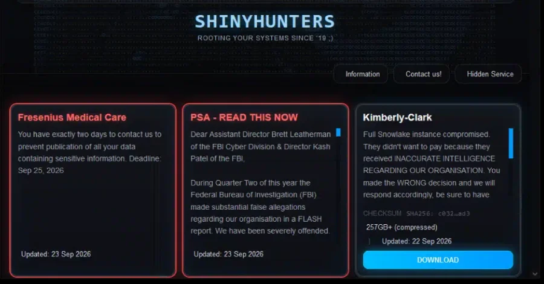

---
hide:
  - toc
---

Security Operations Briefing

# Incidents

A living, day-by-day catalogue of cybersecurity incidents, vulnerabilities, malware campaigns, and threat-actor activity — each entry a standalone briefing on what happened, what's affected, and what to do about it.

<!--INDEX_DATE-->Saturday, September 26, 2026<!--/INDEX_DATE-->

-   {.index-card__img}

    **MikroTrick - MikroTik RouterOS SSH Exploitation Chain**

    **MikroTik RouterOS**{.cve-chip} **MikroTrick**{.cve-chip} **CVE-2026-67276**{.cve-chip} **CVE-2026-86060**{.cve-chip} **Admin Takeover**{.cve-chip}

    Attackers are exploiting a RouterOS SSH chain that can grant full administrative access on vulnerable internet-exposed MikroTik routers without valid credentials.

    [Read more →](2026/Week38/MikroTrick.md){.index-card__cta}

-   {.index-card__img}

    **Zyxel GS1900 CVE-2026-7273 & Veeam Agent for Windows CVE-2026-32996**

    **Zyxel GS1900**{.cve-chip} **CVE-2026-7273**{.cve-chip} **Veeam Agent**{.cve-chip} **CVE-2026-32996**{.cve-chip} **Active Exploitation**{.cve-chip}

    Active attacks combine unauthenticated LAN command execution on Zyxel GS1900 switches and local SYSTEM privilege escalation on vulnerable Veeam Agent for Windows deployments.

    [Read more →](2026/Week38/Zyxel.md){.index-card__cta}

-   {.index-card__img}

    **D-Link DIR-822A - Stack-Based Buffer Overflow (CVE-2026-86296)**

    **D-Link DIR-822A**{.cve-chip} **CVE-2026-86296**{.cve-chip} **Stack Overflow**{.cve-chip} **Unauthenticated**{.cve-chip} **PoC Available**{.cve-chip}

    A critical unauthenticated overflow in DIR-822A DHCP processing can be triggered with crafted traffic and may cause router crash or potential code execution.

    [Read more →](2026/Week38/DLink.md){.index-card__cta}

-   {.index-card__img}

    **ShinyHunters - FBIJobs.gov Data Breach**

    **ShinyHunters**{.cve-chip} **FBIJobs.gov**{.cve-chip} **PeopleSoft RCE Claim**{.cve-chip} **Personnel Data Risk**{.cve-chip} **Federal Portal Incident**{.cve-chip}

    ShinyHunters claimed a breach of FBIJobs.gov with sensitive personnel/applicant data exposure, while the FBI confirmed investigation of unauthorized activity and continued scope assessment.

    [Read more →](2026/Week38/ShinyHunters.md){.index-card__cta}

<footer class="index-footer" markdown>

published by EG-ETCS team on GitHub

<nav class="index-footer__nav" markdown>

[Organization](https://github.com/EG-ETCS){.index-footer__link}

[Incidents Repo](https://github.com/EG-ETCS/Incidents){.index-footer__link}

</nav>

</footer>

