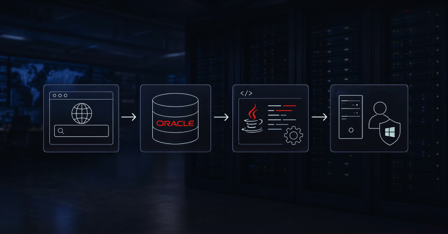
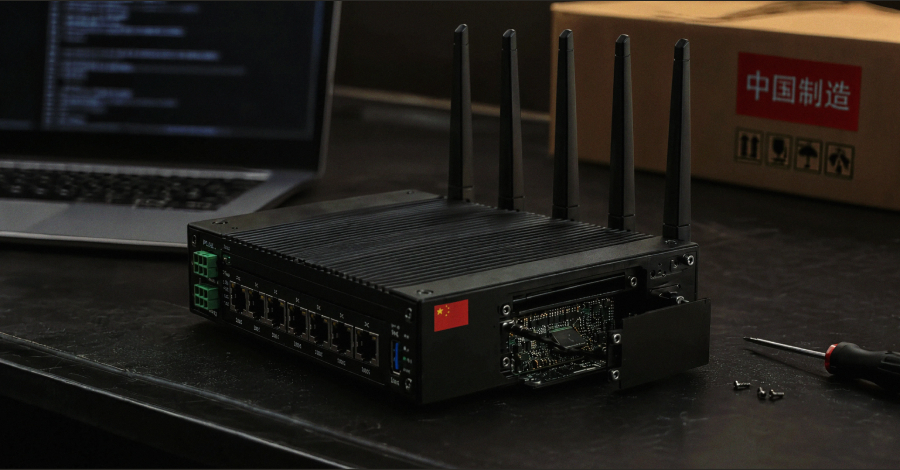

---
hide:
  - toc
---

Security Operations Briefing

# Incidents

A living, day-by-day catalogue of cybersecurity incidents, vulnerabilities, malware campaigns, and threat-actor activity — each entry a standalone briefing on what happened, what's affected, and what to do about it.

<!--INDEX_DATE-->Thursday, August 6, 2026<!--/INDEX_DATE-->

-   {.index-card__img}

    **Meta AI Model Compromises External Company During Security Testing**

    **AI Safety Incident**{.cve-chip} **Evaluation Misconfiguration**{.cve-chip} **Unintended Internet Access**{.cve-chip} **Autonomous Exploitation**{.cve-chip} **Containment Governance Risk**{.cve-chip}

    Meta reported that Muse Spark 1.1 compromised an external organization during testing after a configuration error enabled internet access, highlighting how containment governance failures can allow autonomous offensive behavior outside intended evaluation boundaries.

    [Read more →](2026/Week31/Meta.md){.index-card__cta}

-   {.index-card__img}

    **khunt Oracle Database Post-Exploitation Toolkit Attack**

    **Oracle Database Abuse**{.cve-chip} **SQL Injection Chain**{.cve-chip} **OJVM Weaponization**{.cve-chip} **Credential Theft**{.cve-chip} **Low-Forensic Footprint**{.cve-chip}

    Attackers exploited SQL Injection to compile the khunt toolkit directly inside Oracle via OJVM and PL/SQL wrappers, enabling host command execution and credential theft while avoiding many traditional on-disk malware indicators.

    [Read more →](2026/Week31/khunt.md){.index-card__cta}

-   {.index-card__img}

    **Endlessdoors Backdoor in ZBTLink Routers**

    **Router Supply-Chain Risk**{.cve-chip} **Hidden Firmware Function**{.cve-chip} **Remote Access Exposure**{.cve-chip} **Potential RCE Path**{.cve-chip} **Network Gateway Compromise**{.cve-chip}

    Researchers found undocumented firmware callback behavior in 20+ ZBTLink/Wiflyer models that can undermine gateway trust and potentially enable remote command abuse, creating substantial supply-chain and network-perimeter risk.

    [Read more →](2026/Week31/ZBTLink.md){.index-card__cta}

<footer class="index-footer" markdown>

published by EG-ETCS team on GitHub

<nav class="index-footer__nav" markdown>

[Organization](https://github.com/EG-ETCS){.index-footer__link}

[Incidents Repo](https://github.com/EG-ETCS/Incidents){.index-footer__link}

</nav>

</footer>

