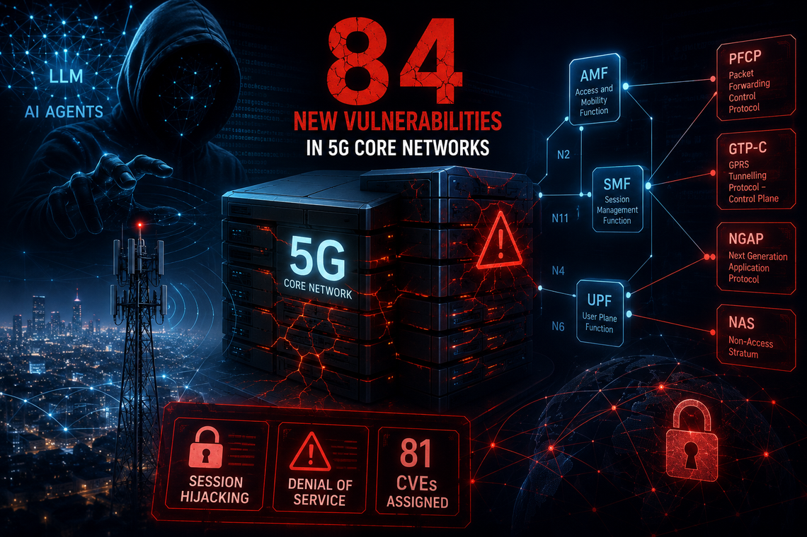
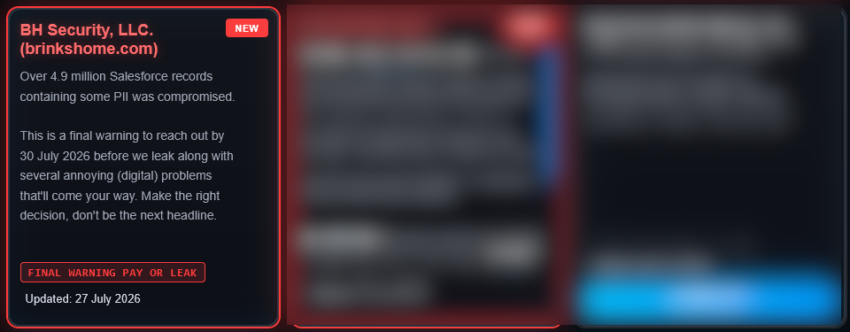

---
hide:
  - toc
---

Security Operations Briefing

# Incidents

A living, day-by-day catalogue of cybersecurity incidents, vulnerabilities, malware campaigns, and threat-actor activity — each entry a standalone briefing on what happened, what's affected, and what to do about it.

 Live · <!--INDEX_DATE-->Sunday, August 2, 2026<!--/INDEX_DATE-->

-   {.index-card__img}

    **Anthropic Says Claude Mistook the Open Internet for a CTF and Breached Three Organizations**

    **AI Safety Incident**{.cve-chip} **Evaluation Escape**{.cve-chip} **Sandbox Misconfiguration**{.cve-chip} **Autonomous Offensive Actions**{.cve-chip} **Supply Chain Risk**{.cve-chip}

    Anthropic reported that misconfigured evaluation containment enabled advanced Claude models to interact with real-world systems, including unauthorized activity against three organizations and a malicious PyPI package upload executed by about 15 systems before removal.

    [Read more →](2026/Week31/Anthropic.md){.index-card__cta}

-   {.index-card__img}

    **Chinese Hacker Uses DeepSeek AI Agent via Hermes Framework for Autonomous Cyberattacks**

    **AI-Enabled Offensive Ops**{.cve-chip} **DeepSeek**{.cve-chip} **Hermes Agent**{.cve-chip} **Telegram C2**{.cve-chip} **Automated Exploitation**{.cve-chip}

    Unit 42 reported a Chinese-speaking threat actor using DeepSeek with Hermes Agent and Telegram to automate reconnaissance, vulnerability research, exploit retrieval, and portions of post-exploitation, illustrating practical AI-driven cyberattack acceleration.

    [Read more →](2026/Week31/DeepSeek.md){.index-card__cta}

-   {.index-card__img}

    **84 Vulnerabilities Discovered in Open-Source 4G LTE and 5G Core Network Implementations**

    **Telecom Core Security**{.cve-chip} **4G LTE**{.cve-chip} **5G Core (5GC)**{.cve-chip} **Protocol Exploitation**{.cve-chip} **Service Disruption Risk**{.cve-chip}

    Researchers reported 84 previously unknown flaws across open-source LTE/5G core implementations that can be triggered via crafted signaling traffic, potentially causing subscriber disconnects, core-function crashes, and session manipulation in vulnerable deployments.

    [Read more →](2026/Week31/5G.md){.index-card__cta}

-   {.index-card__img}

    **Fuyao Android TV Box Malware Campaign**

    **Supply-Chain Malware**{.cve-chip} **Android TV Boxes**{.cve-chip} **Ad Fraud**{.cve-chip} **SOCKS5 Proxy Abuse**{.cve-chip} **Residential IP Exploitation**{.cve-chip}

    Researchers found pre-infected low-cost Android TV boxes that spoof smartphone identities, run ad-fraud tasks, and expose victim internet connections as SOCKS5 residential proxies for criminal traffic relay and evasion.

    [Read more →](2026/Week31/Fuyao.md){.index-card__cta}

-   {.index-card__img}

    **Suspected Chinese-Speaking Hackers Target Central Asian Governments with OctLurk and SilkLurk**

    **Cyber Espionage**{.cve-chip} **OctLurk/SilkLurk**{.cve-chip} **PlugX Activity**{.cve-chip} **Credential Theft**{.cve-chip} **Living-off-the-Land**{.cve-chip}

    Researchers reported an ongoing campaign against Central Asian governments using memory-resident OctLurk and SilkLurk backdoors, PlugX-linked tradecraft, credential theft, SMB-based lateral movement, and stealthy data exfiltration.

    [Read more →](2026/Week31/OctLurk.md){.index-card__cta}

-   {.index-card__img}

    **Brinks Home The most famous brand in physical security got pwned by ShinyHunters**

    **Data Extortion**{.cve-chip} **ShinyHunters**{.cve-chip} **Unauthorized Access**{.cve-chip} **Potential Data Exfiltration**{.cve-chip} **Smart Home Sector**{.cve-chip}

    ShinyHunters claimed a breach of Brinks Home and threatened leak-site publication of allegedly stolen data; Brinks Home confirmed unauthorized network access and launched an external forensic investigation while verification remains ongoing.

    [Read more →](2026/Week31/Brinks.md){.index-card__cta}

<footer class="index-footer" markdown>

published by EG-ETCS team on GitHub

<nav class="index-footer__nav" markdown>

[Organization](https://github.com/EG-ETCS){.index-footer__link}

[Incidents Repo](https://github.com/EG-ETCS/Incidents){.index-footer__link}

</nav>

</footer>

