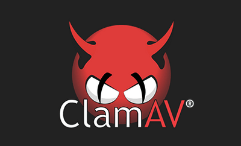
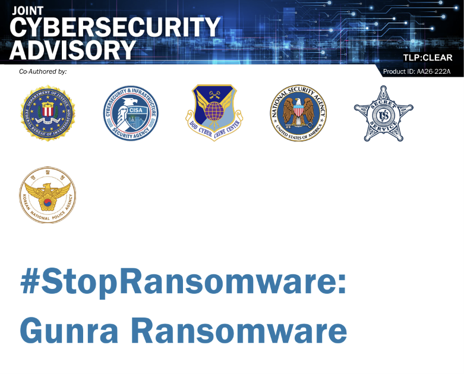

---
hide:
  - toc
---

Security Operations Briefing

# Incidents

A living, day-by-day catalogue of cybersecurity incidents, vulnerabilities, malware campaigns, and threat-actor activity — each entry a standalone briefing on what happened, what's affected, and what to do about it.

<!--INDEX_DATE-->Monday, August 10, 2026<!--/INDEX_DATE-->

-   {.index-card__img}

    **Cisco Warns of Seven ClamAV Flaws, Two With Public PoCs**

    **CVE-2026-20337**{.cve-chip} **CVE-2026-20338**{.cve-chip} **ClamAV Parser Flaws**{.cve-chip} **DoS Risk**{.cve-chip} **Cisco Secure Endpoint**{.cve-chip}

    Cisco disclosed seven ClamAV parser vulnerabilities in Secure Endpoint Connector workflows; two ZIP-related flaws have public PoCs and can allow unauthenticated remote file submission to crash scanning processes.

    [Read more →](2026/Week32/ClamAV.md){.index-card__cta}

-   {.index-card__img}

    **ZOOMSDAY – Zoom Zero-Click Remote Code Execution Vulnerability**

    **CVE-2026-53413**{.cve-chip} **CVE-2026-53414**{.cve-chip} **CVE-2026-53415**{.cve-chip} **Zero-Click RCE**{.cve-chip} **Zoom Annotation Protocol**{.cve-chip}

    Multiple Zoom annotation-protocol flaws, led by CVE-2026-53413, could allow a malicious meeting participant to trigger zero-click remote code execution on another attendee's client.

    [Read more →](2026/Week32/Zoom.md){.index-card__cta}

-   {.index-card__img}

    **Gunra Ransomware Exploits Fortinet to Breach Networks**

    **Gunra RaaS**{.cve-chip} **Double Extortion**{.cve-chip} **CVE-2024-55591**{.cve-chip} **CVE-2025-24472**{.cve-chip} **Fortinet Edge Exploitation**{.cve-chip}

    Gunra affiliates have exploited exposed Fortinet edge infrastructure for initial access, then performed credential theft, MFA bypass activity, lateral movement, data exfiltration, backup destruction, and ransomware deployment.

    [Read more →](2026/Week32/Gunra.md){.index-card__cta}

-   {.index-card__img}

    **Poland Energy Sector IT-to-OT Intrusion via Private APN**

    **IT-to-OT Pivot**{.cve-chip} **Private APN Abuse**{.cve-chip} **Industrial Router Exposure**{.cve-chip} **Siemens PLC Manipulation**{.cve-chip} **Critical Infrastructure**{.cve-chip}

    Attackers pivoted from IT to OT by abusing private APN trust through a Teltonika router path, reached industrial control systems, manipulated Siemens PLC states, and disrupted operations without ultimately interrupting power or heat generation.

    [Read more →](2026/Week32/Poland.md){.index-card__cta}

<footer class="index-footer" markdown>

published by EG-ETCS team on GitHub

<nav class="index-footer__nav" markdown>

[Organization](https://github.com/EG-ETCS){.index-footer__link}

[Incidents Repo](https://github.com/EG-ETCS/Incidents){.index-footer__link}

</nav>

</footer>

