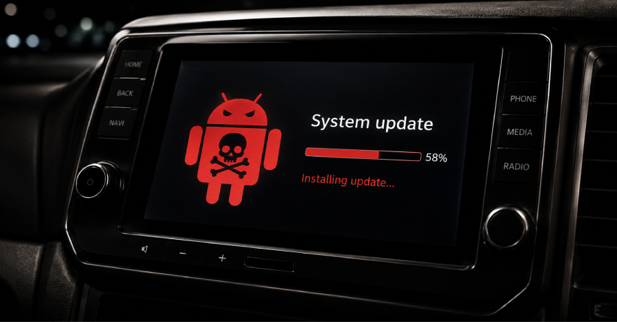
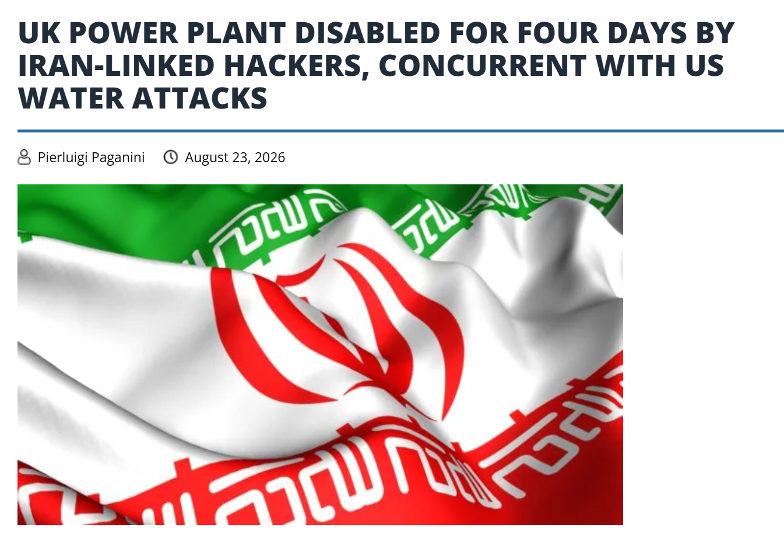

---
hide:
  - toc
---

Security Operations Briefing

# Incidents

A living, day-by-day catalogue of cybersecurity incidents, vulnerabilities, malware campaigns, and threat-actor activity — each entry a standalone briefing on what happened, what's affected, and what to do about it.

<!--INDEX_DATE-->Tuesday, August 25, 2026<!--/INDEX_DATE-->

-   {.index-card__img}

    **DoFun Android Car Head Unit Supply-Chain Malware Campaign**

    **Supply-Chain Malware**{.cve-chip} **Android Head Units**{.cve-chip} **TWCore Abuse**{.cve-chip} **Ad Fraud**{.cve-chip} **Proxy Botnet**{.cve-chip}

    Attackers abused DoFun's TWCore update workflow to install JarService and proxy-botnet payloads, turning infected Android automotive head units into ad-fraud and reverse-proxy nodes.

    [Read more →](2026/Week34/DoFun.md){.index-card__cta}

-   {.index-card__img}

    **UK Small-Scale Power Generator Shutdown Linked to Suspected Iran-Affiliated Cyber Activity**

    **Power Sector Disruption**{.cve-chip} **Suspected Iran-Affiliated Activity**{.cve-chip} **Operational Outage**{.cve-chip} **Attribution Unconfirmed**{.cve-chip} **Critical Infrastructure Risk**{.cve-chip}

    A UK small-scale generator experienced a four-day outage after a cyber incident; while media reports cite Iran-linked actors, official UK public attribution and technical details remain undisclosed.

    [Read more →](2026/Week34/Power.md){.index-card__cta}

<footer class="index-footer" markdown>

published by EG-ETCS team on GitHub

<nav class="index-footer__nav" markdown>

[Organization](https://github.com/EG-ETCS){.index-footer__link}

[Incidents Repo](https://github.com/EG-ETCS/Incidents){.index-footer__link}

</nav>

</footer>

