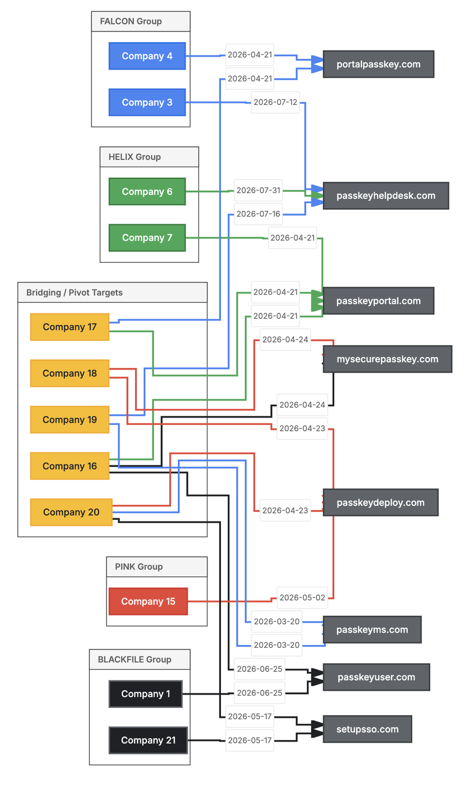

---
hide:
  - toc
---

Security Operations Briefing

# Incidents

A living, day-by-day catalogue of cybersecurity incidents, vulnerabilities, malware campaigns, and threat-actor activity — each entry a standalone briefing on what happened, what's affected, and what to do about it.

<!--INDEX_DATE-->Monday, August 10, 2026<!--/INDEX_DATE-->

-   {.index-card__img}

    **UNC6671 Vishing & Data-Extortion Campaign**

    **UNC6671**{.cve-chip} **Voice Phishing (Vishing)**{.cve-chip} **AiTM Phishing**{.cve-chip} **SaaS Data Theft**{.cve-chip} **Cloud Extortion**{.cve-chip}

    UNC6671 used IT-helpdesk impersonation and AiTM phishing to capture credentials and sessions, then abuse Microsoft 365, Okta, SharePoint, and OneDrive for large-scale cloud data theft followed by extortion demands.

    [Read more →](2026/Week32/Vishing.md){.index-card__cta}

-   {.index-card__img}

    **Metabase Zero-Day Exploited in Wild Allows Admin Access Without Authentication**

    **Metabase SQL Injection**{.cve-chip} **Unauthenticated Attack Path**{.cve-chip} **Admin Takeover Risk**{.cve-chip} **Data Exposure**{.cve-chip} **BI Platform Security**{.cve-chip}

    A critical Metabase SQL injection flaw was exploited in the wild and can allow unauthenticated access paths to administrative control, increasing risk of credential theft and sensitive data exposure through connected enterprise databases.

    [Read more →](2026/Week32/Metabase.md){.index-card__cta}

<footer class="index-footer" markdown>

published by EG-ETCS team on GitHub

<nav class="index-footer__nav" markdown>

[Organization](https://github.com/EG-ETCS){.index-footer__link}

[Incidents Repo](https://github.com/EG-ETCS/Incidents){.index-footer__link}

</nav>

</footer>

