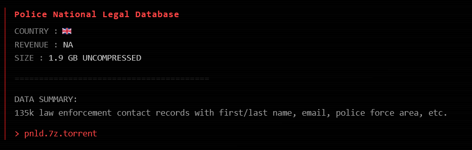

---
hide:
  - toc
---

Security Operations Briefing

# Incidents

A living, day-by-day catalogue of cybersecurity incidents, vulnerabilities, malware campaigns, and threat-actor activity — each entry a standalone briefing on what happened, what's affected, and what to do about it.

<!--INDEX_DATE-->Tuesday, August 4, 2026<!--/INDEX_DATE-->

-   {.index-card__img}

    **INC Ransomware Emerges as Dominant Ransomware Threat**

    **Ransomware-as-a-Service**{.cve-chip} **Cross-Platform Encryption**{.cve-chip} **Double Extortion**{.cve-chip} **BYOVD Evasion**{.cve-chip} **Enterprise Disruption**{.cve-chip}

    INC ransomware has become one of the most active 2026 operations, combining vulnerability exploitation, credential theft, BYOVD security bypass, and Rclone-backed data exfiltration before encrypting Windows, Linux, and ESXi assets.

    [Read more →](2026/Week31/Dominant.md){.index-card__cta}

-   {.index-card__img}

    **Police National Legal Database (PNLD) Data Breach**

    **Data Breach**{.cve-chip} **Law Enforcement Exposure**{.cve-chip} **Dark Web Leak**{.cve-chip} **Data Extortion**{.cve-chip} **Cloud Misconfiguration Risk**{.cve-chip}

    ExfilSquad reportedly stole and leaked approximately 135,000 PNLD records, exposing police and justice-sector personnel contact data and raising significant spear-phishing, social-engineering, and OPSEC risks despite no confirmed compromise of classified policing systems.

    [Read more →](2026/Week31/Police.md){.index-card__cta}

<footer class="index-footer" markdown>

published by EG-ETCS team on GitHub

<nav class="index-footer__nav" markdown>

[Organization](https://github.com/EG-ETCS){.index-footer__link}

[Incidents Repo](https://github.com/EG-ETCS/Incidents){.index-footer__link}

</nav>

</footer>

