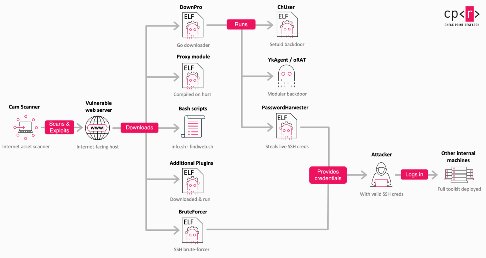
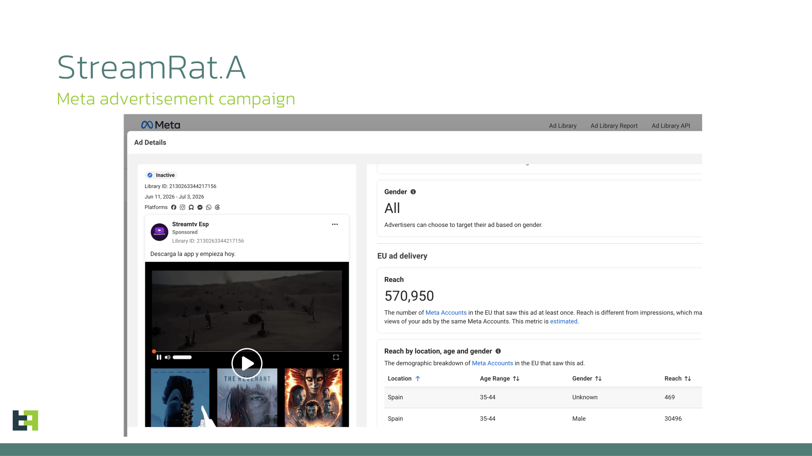

---
hide:
  - toc
---

Security Operations Briefing

# Incidents

A living, day-by-day catalogue of cybersecurity incidents, vulnerabilities, malware campaigns, and threat-actor activity — each entry a standalone briefing on what happened, what's affected, and what to do about it.

<!--INDEX_DATE-->Tuesday, September 8, 2026<!--/INDEX_DATE-->

-   {.index-card__img}

    **Brazilian Government Traffic Hijacking Campaign**

    **Traffic Hijacking**{.cve-chip} **Malicious Apache Modules**{.cve-chip} **SEO Poisoning**{.cve-chip} **Government Domains**{.cve-chip} **Gambling Goblin**{.cve-chip}

    A reported Chinese-speaking group hijacked traffic on compromised Brazilian government and education domains using malicious Apache modules that proxied visitors to phishing and betting content.

    [Read more →](2026/Week36/Brazilian.md){.index-card__cta}

-   {.index-card__img}

    **Meta Ads Push StreamRat Android Trojan That Can Gain Near-Complete Device Control**

    **Android Trojan**{.cve-chip} **Malvertising**{.cve-chip} **StreamRat**{.cve-chip} **Accessibility Abuse**{.cve-chip} **Remote Device Control**{.cve-chip}

    StreamRat is being spread through malicious ad-to-sideload chains that abuse Accessibility permissions for credential theft, overlays, and near-complete remote control of infected Android devices.

    [Read more →](2026/Week36/Meta.md){.index-card__cta}

<footer class="index-footer" markdown>

published by EG-ETCS team on GitHub

<nav class="index-footer__nav" markdown>

[Organization](https://github.com/EG-ETCS){.index-footer__link}

[Incidents Repo](https://github.com/EG-ETCS/Incidents){.index-footer__link}

</nav>

</footer>

