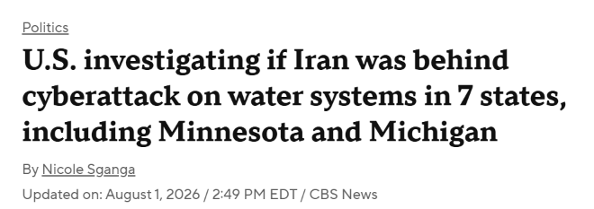

---
hide:
  - toc
---

Security Operations Briefing

# Incidents

A living, day-by-day catalogue of cybersecurity incidents, vulnerabilities, malware campaigns, and threat-actor activity — each entry a standalone briefing on what happened, what's affected, and what to do about it.

<!--INDEX_DATE-->Tuesday, August 4, 2026<!--/INDEX_DATE-->

-   {.index-card__img}

    **TP-Link Omada ZTP Vulnerabilities Enabling Network Compromise**

    **ZTP Trust Breakdown**{.cve-chip} **Omada Ecosystem Risk**{.cve-chip} **Controller Compromise**{.cve-chip} **MitM and Adoption Hijack**{.cve-chip} **Enterprise and IoT Exposure**{.cve-chip}

    Forescout disclosed 15 Omada ZTP weaknesses that undermine provisioning trust, enabling adoption hijack, credential exposure, and potential controller/gateway compromise, with expanded risk when chained with prior Omada command-injection flaws.

    [Read more →](2026/Week31/TP-Link.md){.index-card__cta}

-   {.index-card__img}

    **Multi-state U.S. Water-System PLC Cyberattacks (Minnesota, Michigan, Georgia, and Other States)**

    **Water Utility OT Threat**{.cve-chip} **PLC Intrusions**{.cve-chip} **Multi-State Disruption**{.cve-chip} **Iran-Linked Suspicion**{.cve-chip} **Critical Infrastructure Risk**{.cve-chip}

    Utilities in multiple U.S. states reported unauthorized PLC access and operational disruption patterns consistent with broader CISA/FBI warnings on exposed OT systems, with Iran-linked actors widely cited as leading suspects pending formal attribution.

    [Read more →](2026/Week31/water.md){.index-card__cta}

<footer class="index-footer" markdown>

published by EG-ETCS team on GitHub

<nav class="index-footer__nav" markdown>

[Organization](https://github.com/EG-ETCS){.index-footer__link}

[Incidents Repo](https://github.com/EG-ETCS/Incidents){.index-footer__link}

</nav>

</footer>

