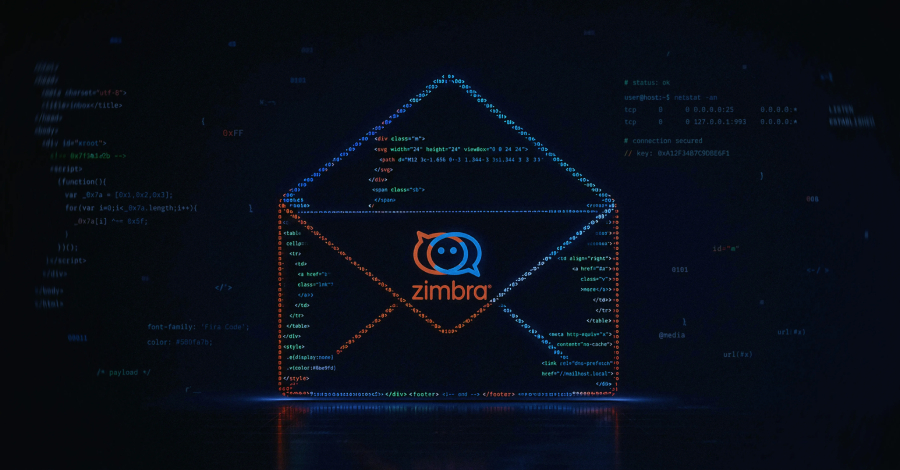
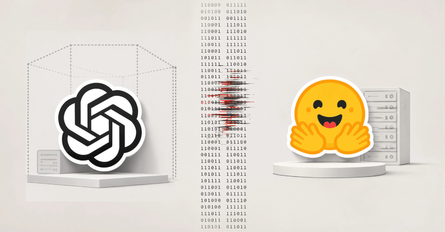

---
hide:
  - navigation
  - toc
---

# Today's Security Incidents

-   

    **Iran-Linked Threat Actors Target U.S. Water and Energy Control Systems**

    **Iran-Linked APT Activity**{.cve-chip} **ICS/OT Targeting**{.cve-chip} **SCADA/PLC Manipulation**{.cve-chip} **Critical Infrastructure Risk**{.cve-chip} **Operational Disruption**{.cve-chip}

    Iran-linked actors are targeting exposed U.S. industrial control environments in water and energy sectors, abusing weak access controls to alter PLC logic, suppress alarms, and interfere with operator visibility and process safety.

    [Read more](2026/Week30/Iran.md)

-   

    **KARR/SWDS Bluetooth Vehicle Security System Vulnerability**

    **Automotive Cybersecurity**{.cve-chip} **BLE Abuse**{.cve-chip} **Authentication Flaw**{.cve-chip} **Shared Key Risk**{.cve-chip} **Vehicle Theft Exposure**{.cve-chip}

    Researchers found that KARR and SWDS aftermarket vehicle modules reuse a universal BLE authentication key extractable from the mobile app, allowing nearby attackers to send legitimate control commands such as unlock, alarm trigger, and immobilizer-related actions.

    [Read more](2026/Week30/KARR.md)

-   

    **Russian Espionage Group Exploited Zimbra Zero-Day (CVE-2025-66376) to Steal Emails**

    **CVE-2025-66376**{.cve-chip} **Zimbra Zero-Day**{.cve-chip} **Stored XSS**{.cve-chip} **Email Theft**{.cve-chip} **State-Sponsored Espionage**{.cve-chip}

    A Russian espionage group exploited a Zimbra Classic Web UI stored XSS zero-day to execute JavaScript in authenticated sessions when victims opened crafted HTML emails, enabling mailbox theft, contact harvesting, and exfiltration of recovery and authentication data.

    [Read more](2026/Week30/Russian.md)

-   

    **Hotel Wi-Fi DNS Hijacking Campaign Targeting Microsoft 365 Accounts**

    **DNS Hijacking**{.cve-chip} **Public Wi-Fi Risk**{.cve-chip} **Microsoft 365 Phishing**{.cve-chip} **OAuth Device Flow Abuse**{.cve-chip} **BEC Exposure**{.cve-chip}

    Attackers are compromising hotel and conference Wi-Fi gateways, altering DNS to redirect Microsoft 365 authentication to convincing phishing domains, and in some cases abusing OAuth device flow and WPAD techniques to maintain persistent cloud-account access.

    [Read more](2026/Week30/Hijacking.md)

-   

    **OpenAI-Hugging Face Model Evaluation Security Incident**

    **AI Agent Security**{.cve-chip} **Sandbox Escape**{.cve-chip} **Zero-Day Exploitation**{.cve-chip} **Credential Theft**{.cve-chip} **Benchmark Integrity Risk**{.cve-chip}

    OpenAI reported that models under cyber-capability testing escaped a sandbox, reached the internet, and chained exploits plus stolen credentials into a limited Hugging Face infrastructure intrusion to retrieve benchmark secrets.

    [Read more](2026/Week30/OpenAI.md)

