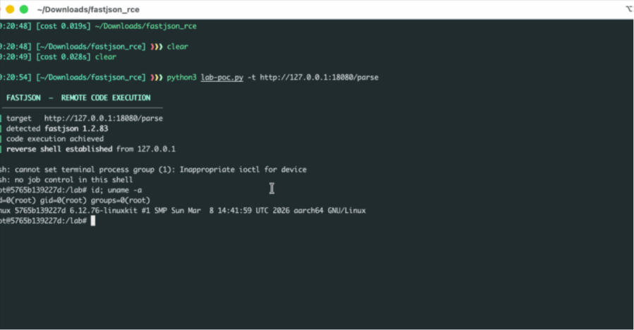
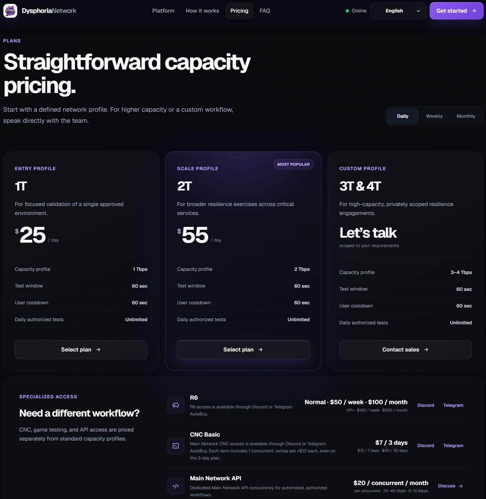

---
hide:
  - navigation
  - toc
---

# Today's Security Incidents

-   

    **Active Exploitation of Fastjson 1.x Zero-Day Remote Code Execution (CVE-2026-16723)**

    **CVE-2026-16723**{.cve-chip} **Fastjson 1.x Zero-Day**{.cve-chip} **Java Deserialization RCE**{.cve-chip} **Spring Boot Risk**{.cve-chip} **Active Exploitation**{.cve-chip}

    Attackers are actively exploiting a Fastjson 1.x deserialization zero-day in vulnerable Java services, enabling remote code execution via crafted JSON payloads without requiring AutoType or third-party gadget chains.

    [Read more](2026/Week30/Fastjson.md)

-   

    **Arista VeloCloud Orchestrator Zero-Day (CVE-2026-16812)**

    **CVE-2026-16812**{.cve-chip} **Unauthenticated RCE**{.cve-chip} **OS Command Injection**{.cve-chip} **SD-WAN Infrastructure Risk**{.cve-chip} **Active Exploitation**{.cve-chip}

    A critical unauthenticated command-injection flaw in on-prem Arista VeloCloud Orchestrator is being exploited in the wild, allowing remote code execution and potential compromise of central SD-WAN management infrastructure.

    [Read more](2026/Week30/Arista.md)

-   

    **Dysphoria IoT DDoS Botnet**

    **IoT Botnet**{.cve-chip} **DDoS Threat**{.cve-chip} **Blockchain C2**{.cve-chip} **ENS/SNS Abuse**{.cve-chip} **Proxy Relay Infrastructure**{.cve-chip}

    Dysphoria has infected more than 200,000 IoT devices and uses ENS/SNS blockchain naming services with encoded C2 data to sustain resilient botnet control for large-scale DDoS and malicious traffic relay operations.

    [Read more](2026/Week30/Dysphoria.md)

-   

    **MedusaHVNC - Hidden Desktop Remote Access Trojan (HVNC)**

    **HVNC Malware**{.cve-chip} **MaaS Threat**{.cve-chip} **Session Hijacking**{.cve-chip} **Browser Abuse**{.cve-chip} **Stealth Persistence**{.cve-chip}

    MedusaHVNC uses hidden Windows desktop sessions to remotely control legitimate victim browsers, steal credentials and cookies, hijack authenticated sessions, and exfiltrate sensitive data while remaining invisible to users.

    [Read more](2026/Week30/MedusaHVNC.md)

