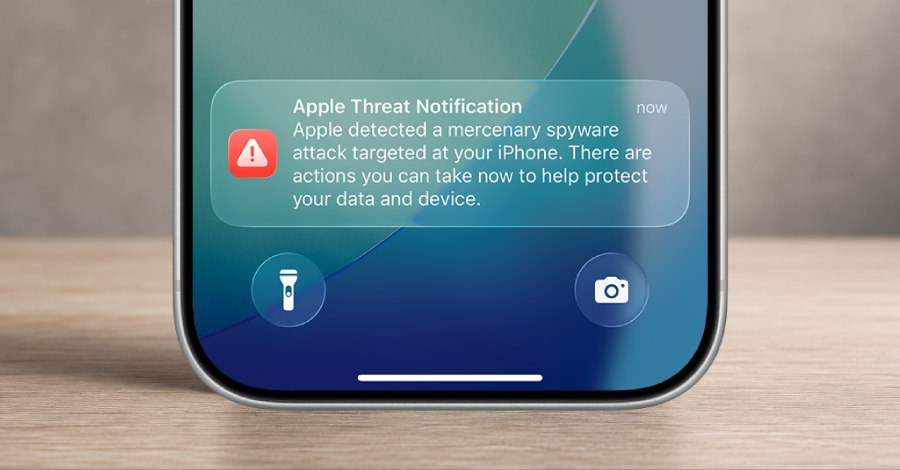

---
hide:
  - toc
---

Security Operations Briefing

# Incidents

A living, day-by-day catalogue of cybersecurity incidents, vulnerabilities, malware campaigns, and threat-actor activity — each entry a standalone briefing on what happened, what's affected, and what to do about it.

<!--INDEX_DATE-->Wednesday, August 19, 2026<!--/INDEX_DATE-->

-   {.index-card__img}

    **Unisoc VoLTE Video Call Exploit Chain – Modem-to-Android Kernel Privilege Escalation**

    **Unisoc Baseband Security**{.cve-chip} **VoLTE Attack Surface**{.cve-chip} **Modem RCE**{.cve-chip} **CWE-1189**{.cve-chip} **Kernel Privilege Escalation**{.cve-chip}

    Researchers demonstrated a two-stage Unisoc exploit path where malicious VoLTE call signaling can lead from modem compromise toward Android kernel-level impact on vulnerable devices.

    [Read more →](2026/Week33/VoLTE.md){.index-card__cta}

-   {.index-card__img}

    **Apple Mercenary Spyware Threat Notifications – 2026**

    **Apple Threat Notifications**{.cve-chip} **Mercenary Spyware**{.cve-chip} **High-Value Targeting**{.cve-chip} **Potential Zero-Click Exploits**{.cve-chip} **Mobile Surveillance Risk**{.cve-chip}

    Apple warned users in 110 countries of potential mercenary-spyware targeting, highlighting sophisticated high-value surveillance operations and recommending Lockdown Mode and immediate device updates.

    [Read more →](2026/Week33/Apple.md){.index-card__cta}

-   {.index-card__img}

    **New PATCHCORD Backdoor Targets Afghan Telecom and Indian Critical Infrastructure**

    **PATCHCORD Backdoor**{.cve-chip} **SHEETCORD Implant**{.cve-chip} **APT36 / Transparent Tribe**{.cve-chip} **Telecom Targeting**{.cve-chip} **Google Sheets C2**{.cve-chip}

    A targeted espionage campaign used fake VPN and telecom installers to deploy PATCHCORD and a related SHEETCORD implant that abuses Google Sheets API traffic for covert command-and-control.

    [Read more →](2026/Week33/PATCHCORD.md){.index-card__cta}

<footer class="index-footer" markdown>

published by EG-ETCS team on GitHub

<nav class="index-footer__nav" markdown>

[Organization](https://github.com/EG-ETCS){.index-footer__link}

[Incidents Repo](https://github.com/EG-ETCS/Incidents){.index-footer__link}

</nav>

</footer>

