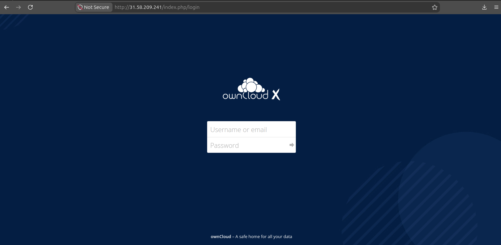
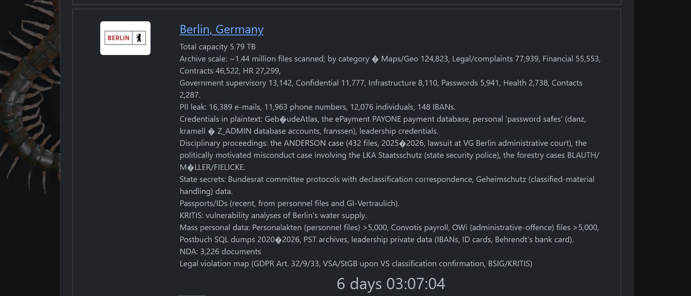
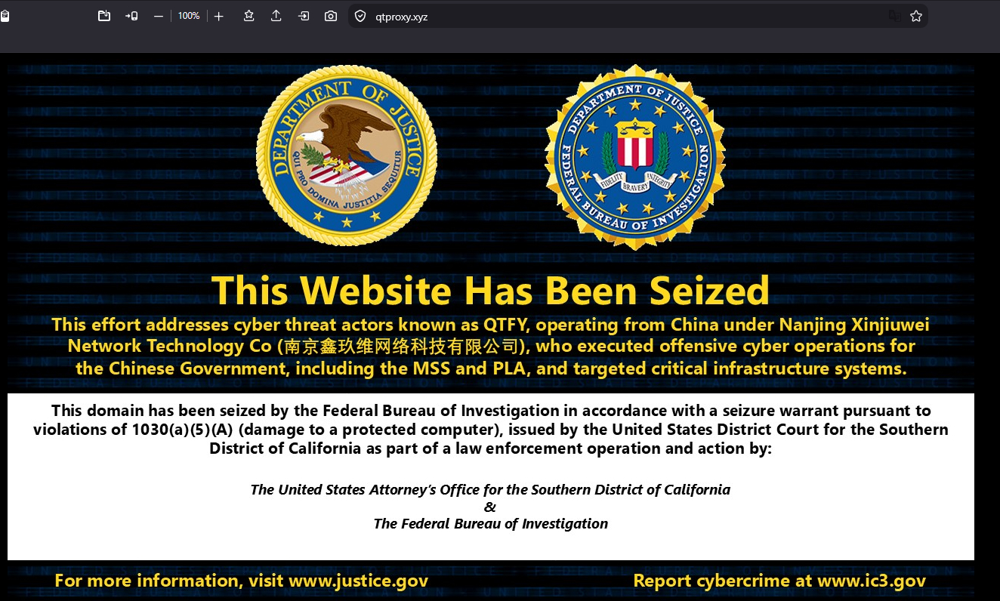

---
hide:
  - toc
---

Security Operations Briefing

# Incidents

A living, day-by-day catalogue of cybersecurity incidents, vulnerabilities, malware campaigns, and threat-actor activity — each entry a standalone briefing on what happened, what's affected, and what to do about it.

<!--INDEX_DATE-->Tuesday, September 1, 2026<!--/INDEX_DATE-->

-   {.index-card__img}

    **Philippine Nuclear and Naval Targets Hit by Suspected Chinese Operator**

    **Cyber Espionage**{.cve-chip} **Critical Infrastructure Targeting**{.cve-chip} **Maritime Defense Sector**{.cve-chip} **CVE-2023-49105**{.cve-chip} **CVE-2024-28000**{.cve-chip}

    A suspected Chinese-speaking operator reportedly exploited ownCloud and WordPress flaws to compromise Philippine nuclear research and naval-linked maritime organizations, with sensitive data theft and follow-on espionage risk.

    [Read more →](2026/Week35/Philippine.md){.index-card__cta}

-   {.index-card__img}

    **Rhysida Ransomware Group Targets Berlin Government Ahead of Vote**

    **Rhysida Ransomware**{.cve-chip} **Government Targeting**{.cve-chip} **Pre-Election Pressure**{.cve-chip} **Data Extortion**{.cve-chip} **Attribution Unconfirmed**{.cve-chip}

    Rhysida claimed a large data theft and extortion attempt against Berlin's administrative network before elections, while officials refused payment and reported no impact to election infrastructure.

    [Read more →](2026/Week35/Rhysida.md){.index-card__cta}

-   {.index-card__img}

    **FBI Disrupts China-Linked QTFY Infrastructure (QScan and QTRouter)**

    **QTFY Activity**{.cve-chip} **QScan**{.cve-chip} **QTRouter**{.cve-chip} **Proxy Obfuscation**{.cve-chip} **China-Linked Intrusions**{.cve-chip}

    U.S. authorities disrupted QScan and QTRouter infrastructure used to compromise internet-connected devices and obfuscate espionage traffic, with later DOJ clarification that listed organizations were targets, not necessarily all confirmed victims.

    [Read more →](2026/Week35/FBI.md){.index-card__cta}

<footer class="index-footer" markdown>

published by EG-ETCS team on GitHub

<nav class="index-footer__nav" markdown>

[Organization](https://github.com/EG-ETCS){.index-footer__link}

[Incidents Repo](https://github.com/EG-ETCS/Incidents){.index-footer__link}

</nav>

</footer>

