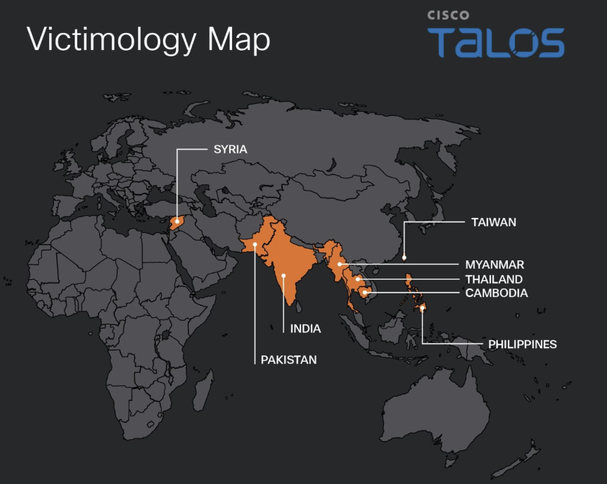
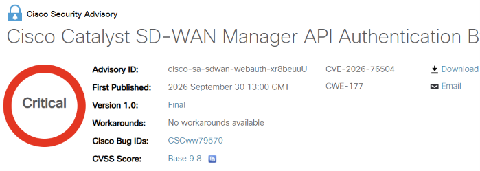

---
hide:
  - toc
---

Security Operations Briefing

# Incidents

A living, day-by-day catalogue of cybersecurity incidents, vulnerabilities, malware campaigns, and threat-actor activity — each entry a standalone briefing on what happened, what's affected, and what to do about it.

<!--INDEX_DATE-->Sunday, October 4, 2026<!--/INDEX_DATE-->

-   {.index-card__img}

    **Star Blizzard - RedFlick / CosmicPulse Campaign**

    **Star Blizzard**{.cve-chip} **RedFlick**{.cve-chip} **CosmicPulse**{.cve-chip} **Phishing Operations**{.cve-chip} **Scheduled Tasks**{.cve-chip}

    Microsoft links this campaign to expanded Star Blizzard phishing operations using fake event invites, staged payload delivery, and RedFlick task-based execution that deploys CosmicPulse.

    [Read more →](2026/Week39/Blizzard.md){.index-card__cta}

-   {.index-card__img}

    **UAT-11587 - Antino Backdoor Campaign**

    **UAT-11587**{.cve-chip} **China-nexus**{.cve-chip} **Antino**{.cve-chip} **Rust Backdoor**{.cve-chip} **Microsoft Graph C2**{.cve-chip}

    Talos links this campaign to a China-nexus cluster using tailored phishing, multi-stage loaders, and Microsoft 365 dead-drop style C2 via Graph, Outlook, and OneDrive.

    [Read more →](2026/Week39/Antino.md){.index-card__cta}

-   {.index-card__img}

    **Cisco Catalyst SD-WAN Manager Authentication Bypass**

    **Cisco**{.cve-chip} **CVE-2026-76504**{.cve-chip} **SD-WAN Manager**{.cve-chip} **Auth Bypass**{.cve-chip} **Actively Exploited**{.cve-chip}

    A URI-encoding flaw in SD-WAN Manager authentication handling can allow unauthenticated attackers to bypass login controls and gain administrator-level API access.

    [Read more →](2026/Week39/Cisco.md){.index-card__cta}

-   {.index-card__img}

    **Apple CoreGraphics Zero-Day - CVE-2026-86950**

    **Apple**{.cve-chip} **CoreGraphics**{.cve-chip} **CVE-2026-86950**{.cve-chip} **PDF Exploit Path**{.cve-chip} **Memory Corruption**{.cve-chip}

    Apple patched a CoreGraphics out-of-bounds write vulnerability that may have been exploited in highly targeted attacks, with public research showing a PDF/font-based memory-corruption path.

    [Read more →](2026/Week39/CoreGraphics.md){.index-card__cta}

<footer class="index-footer" markdown>

published by EG-ETCS team on GitHub

<nav class="index-footer__nav" markdown>

[Organization](https://github.com/EG-ETCS){.index-footer__link}

[Incidents Repo](https://github.com/EG-ETCS/Incidents){.index-footer__link}

</nav>

</footer>

