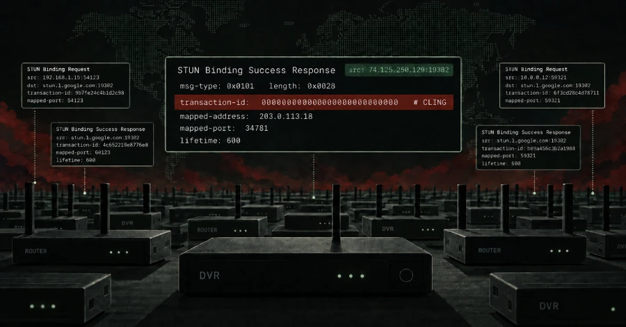

---
hide:
  - toc
---

Security Operations Briefing

# Incidents

A living, day-by-day catalogue of cybersecurity incidents, vulnerabilities, malware campaigns, and threat-actor activity — each entry a standalone briefing on what happened, what's affected, and what to do about it.

<!--INDEX_DATE-->Friday, October 9, 2026<!--/INDEX_DATE-->

-   {.index-card__img}

    **Mabna Institute Cyber-Theft Campaign**

    **Mabna Institute**{.cve-chip} **Academic IP Theft**{.cve-chip} **Spear-Phishing**{.cve-chip} **31+ TB**{.cve-chip} **8,000 Accounts**{.cve-chip}

    Prosecutors allege a years-long campaign targeting universities, compromising professor accounts and exfiltrating large volumes of research and intellectual property.

    [Read more →](2026/Week40/Mabna.md){.index-card__cta}

-   {.index-card__img}

    **Realtek Jungle SDK Exploitation - Cling IoT Botnet**

    **Realtek**{.cve-chip} **CVE-2021-35394**{.cve-chip} **Cling**{.cve-chip} **IoT Botnet**{.cve-chip} **STUN C2**{.cve-chip}

    Active exploitation of Realtek Jungle SDK devices is delivering Cling malware, which persists on IoT systems and uses STUN-like command channels to blend C2 traffic.

    [Read more →](2026/Week40/Realtek.md){.index-card__cta}

-   {.index-card__img}

    **TA419 - China-Aligned Targeted Phishing**

    **TA419**{.cve-chip} **AitM**{.cve-chip} **Frameless BitB**{.cve-chip} **Microsoft 365**{.cve-chip} **AI Policy**{.cve-chip}

    Targeted phishing reportedly impersonated trusted policy figures to steal Microsoft cloud credentials and sessions from U.S. AI-policy experts through AitM and fake sign-in workflows.

    [Read more →](2026/Week40/TA419.md){.index-card__cta}

-   {.index-card__img}

    **ShinyHunters Suspect "Rey" Detained in Jordan**

    **ShinyHunters**{.cve-chip} **Rey / ReyXBF**{.cve-chip} **Jordan**{.cve-chip} **FBI Cooperation**{.cve-chip} **Law Enforcement**{.cve-chip}

    Public reporting says Jordanian authorities detained an alleged ShinyHunters-linked suspect and that cooperation with investigators may help identify additional members and infrastructure.

    [Read more →](2026/Week40/ShinyHunters.md){.index-card__cta}

<footer class="index-footer" markdown>

published by EG-ETCS team on GitHub

<nav class="index-footer__nav" markdown>

[Organization](https://github.com/EG-ETCS){.index-footer__link}

[Incidents Repo](https://github.com/EG-ETCS/Incidents){.index-footer__link}

</nav>

</footer>

